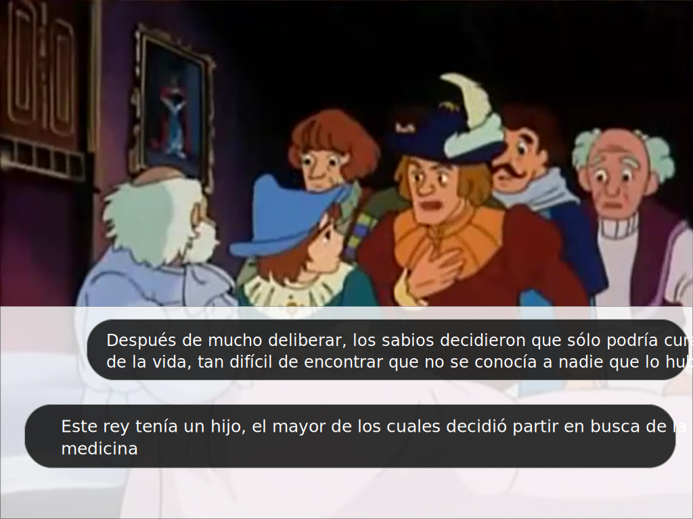

# 

## El Reto
El Ministerio de educación se planteó la siguiente problemática: 
¿Cómo podemos mejorar la comprensión lectora en nuestros estudiantes de secundaria aprovechando las TIC pero sin depender de conectividad?

## Criterios de evaluación obligatorios:
*Las soluciones deben promover la comprensión lectora (obligatorio, verificado por el jurado). 
*Las soluciones deben adaptarse innovadoramente a escenarios de escasa y nula conectividad (obligatorio, verificado por el jurado). 
*Las soluciones deben exhibir licencias de software de código abierto, permisivas, como la MIT Open Source License o compatibles, el contenido debe contar con licencias Creative Commons o similares (obligatorio, verificado por el jurado). 

## Decisión del proyecto
Viendo la problemática presentada, decidimos realizar el proyecto Yachani  
Este proyecto se concreta en un aplicativo con extención .apk, el cual puede ser instalado en cualquier dispositivo electrónico (pc, laptop, tablet, smartphone); y ejecutarse sin necesidad de tener internet.

## Desarrollado con:

`HTML` `JavaScript` `CSS`

## Funcionalidades
### Inicio: Jugar como  
Al ingresar en el aplicativo veremos 2 opciones para elegir la modalidad de juego: Protagonista o Grupo.  
Inmediatamente después debe colocar su nombre.  
  
Si el escolar elige la opción de Protagonista ingresará al juego de forma individual; por lo que las preguntas de comprensión lectora y la interacción será netamente personal. 
Por otro lado, si elige, Grupo; se le brindará la opción de adicionar jugadores en ese perfil, por lo que las preguntas se responderán por cada jugador adicionado; siendo el puntaje final el promedio de las mismas. 

### Género  
En este campo, el escolar podrá elegir el género varios que más prefiera.
  

### Lecturas  
También podrá elegir la lectura que más le agrade.  
Una vez elegido ello, empezará a aparecer la lectura mediante globos de diálogos.  

### Preguntas de comprensión lectora  
Cada cierta cantidad de lectura, se realizará una pregunta de comprensión lectora, las cuales pueden ser de tipo factual, inferencial o léxica; teniendo 3 alternativas de respuesta posible.
Cada respuesta le da cierto puntaje al escolar.
.
.

###   
##  Créditos
* ![MilagrosGutierrez] (https://github.com/mili01gm)
* ![FlorTello] (https://github.com/FlorTello)
* ![Miriam Peralta] (https://github.com/miriampc)
* ![RuthSalvador] (https://github.com/RuthSalvador)
* ![Jean Pierre]
* ![Luis]

